# 🧩 React Component Library

A modern, reusable **React component library** built with **TypeScript**, **Vite**, **Tailwind CSS**, and **Storybook** for developing and showcasing UI components.

---

## ⚙️ Setup & Scripts

Make sure you have **Node.js ≥ 18** and **pnpm / npm / yarn** installed.

### 📦 Install Dependencies

```bash
pnpm install
# or
npm install
# or
yarn install

## 📸 Component Previews

Here are visual previews of the UI components included in this library.

### 🔢 Inputs

|                           Preview                           | Description                            |
| :---------------------------------------------------------: | :------------------------------------- |
|                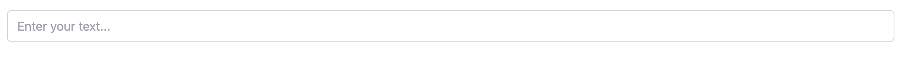                | Default input field                    |
|     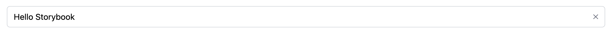     | Input field with clear button          |
|         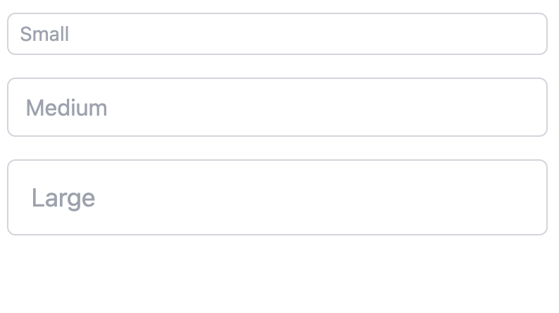         | Input component in different sizes     |
|        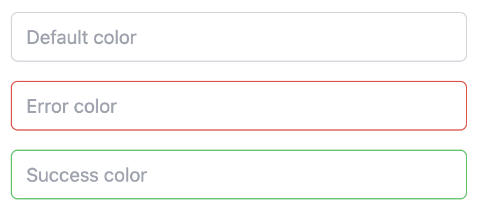        | Input component with color variations  |
|      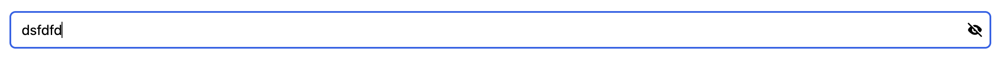      | Password input field with hidden text  |
| 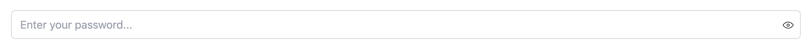 | Password input field with text visible |

---

### 🧭 Sidebar Menu

|                     Preview                     | Description                |
| :---------------------------------------------: | :------------------------- |
|    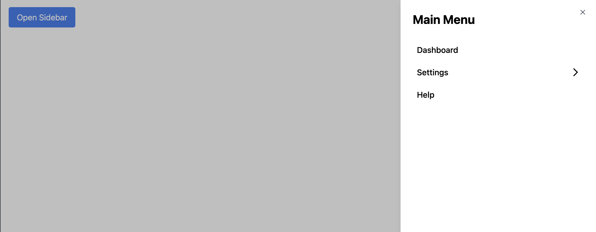     | Sidebar in collapsed state |
| 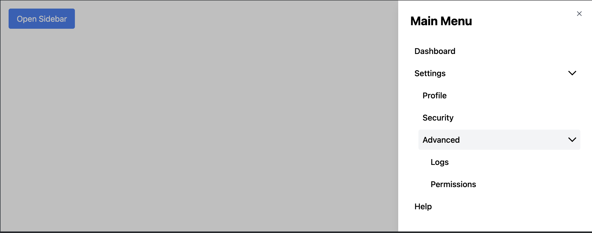 | Sidebar in expanded state  |

---

### 🔔 Toast Notifications

|                    Preview                    | Description                           |
| :-------------------------------------------: | :------------------------------------ |
|         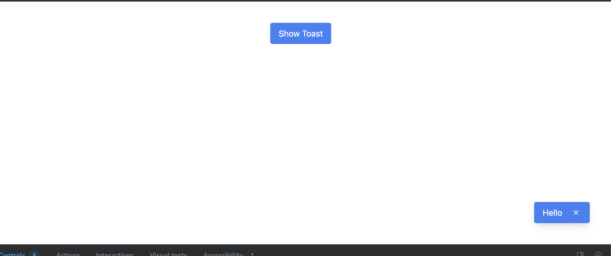         | Default toast notification            |
|  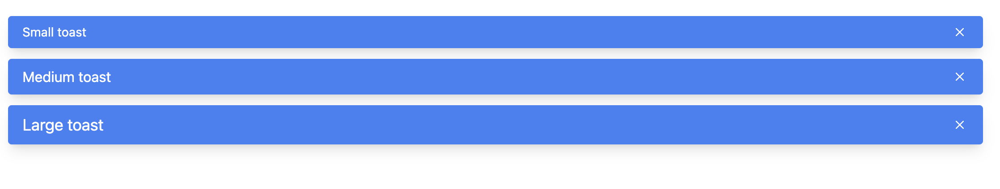  | Toast component in different sizes    |
| 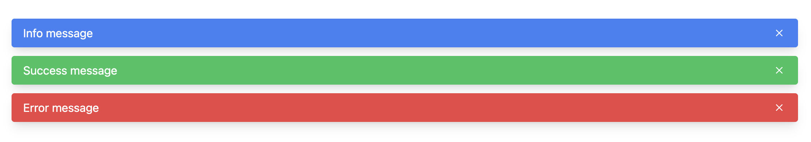 | Toast component with color variations |
```
